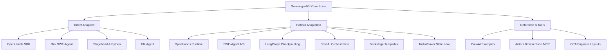

# External Project Agent Integration Plan — Faz 0

> [!NOTE]
> This document details the architectural boundaries and integration patterns for incorporating the capabilities of **15 external repositories** into the **Sovereign AGI** system. The existing **Egemen YAZ** framework remains the core spine; external code is integrated exclusively through adapters or pattern references, ensuring **zero vendoring** in Phase 0.

---

## 1. Integration Classifications

To maintain architectural integrity and strict security, every external repository is mapped to a single integration mode:

| Integration Mode | Description | Verification Gate |
| :--- | :--- | :--- |
| **`direct_adapter`** | Dynamically wrapped using dedicated python classes/schemas, interfacing via subprocess, API, or local execution with strict boundaries. | Code review & mock tests |
| **`pattern_only`** | Conceptual and algorithmic patterns adopted into the Egemen YAZ core engine instead of running external code directly. | Architecture audit |
| **`reference_only`** | Passive codebase utilized only for persona prompting templates and architectural references. | Metadata audit |
| **`optional_tool`** | Added to the agent's toolbelt as a dynamic, optional execution utility, disabled by default. | Safety scan |
| **`blocked`** | Strictly prohibited from execution or referencing due to severe security, alignment, or overlap risks. | Static analysis gate |

---

## 2. Comprehensive Repository Analysis

Below is the exhaustive mapping and strategy for all 15 repositories:

### 2.1. OpenHands/OpenHands
* **Classification**: `pattern_only`
* **Purpose**: Developer agent runtime and isolated sandbox structure.
* **Egemen YAZ Integration Strategy**: We adapt the **Event Stream** architecture of OpenHands (where every tool call, output, and thought is saved as a structured event) to enhance our event tracking, avoiding their heavy execution backend.

### 2.2. OpenHands/software-agent-sdk
* **Classification**: `direct_adapter`
* **Purpose**: Workspace-centric coding agent connection interface.
* **Egemen YAZ Integration Strategy**: Create an adapter module `services/adapters/openhands_sdk_adapter.py` that translates workspace files and edits into the SDK's standard interface, allowing interoperability with standard OpenHands agents if needed.

### 2.3. swe-agent/swe-agent
* **Classification**: `pattern_only`
* **Purpose**: Efficient issue-to-patch execution loop using Agent-Computer Interfaces (ACI).
* **Egemen YAZ Integration Strategy**: Replicate the ACI command-line system design (like limited navigation, precise line editing, and test validation commands) in our local tool declarations. We do not run the heavy Docker-based SWE-agent directly.

### 2.4. SWE-agent/mini-swe-agent
* **Classification**: `direct_adapter`
* **Purpose**: Extremely lightweight, fast task execution pattern.
* **Egemen YAZ Integration Strategy**: Design `services/adapters/mini_swe_adapter.py` to invoke lightweight model tasks using precise system prompt parameters to execute small-scale edits rapidly without starting heavy agent loops.

### 2.5. browserbase/stagehand
* **Classification**: `direct_adapter`
* **Purpose**: Modern UI diagnostics, telemetry (DOM, console, network), and browser assertions.
* **Egemen YAZ Integration Strategy**: Wrap via `services/adapters/stagehand_adapter.py` to query local Playwright telemetry, run assertions, and capture visual state (DOM states/screenshots) for validation.

### 2.6. browserbase/stagehand-python
* **Classification**: `direct_adapter`
* **Purpose**: Python SDK for backend UI assertion testing.
* **Egemen YAZ Integration Strategy**: Implement `services/adapters/stagehand_python_adapter.py` to allow backend validators within our Verifier Mesh to execute complex visual checking steps.

### 2.7. browserbase/mcp-server-browserbase
* **Classification**: `optional_tool`
* **Purpose**: MCP server for cloud browser automation.
* **Egemen YAZ Integration Strategy**: Registered as an optional MCP server configuration in `mcp_config.json`, enabling high-tier agents to invoke remote browser validation when local headless execution is restricted.

### 2.8. The-PR-Agent/pr-agent
* **Classification**: `direct_adapter`
* **Purpose**: Automated PR description, review, and risk assessment comments.
* **Egemen YAZ Integration Strategy**: Build `services/adapters/pr_agent_adapter.py` to parse git diffs and invoke PR-Agent review logic, injecting the outputs directly into the Github PR adapter in our rollout steps.

### 2.9. langchain-ai/langgraph
* **Classification**: `pattern_only`
* **Purpose**: Durable state-machine workflow engine with human-in-the-loop gates.
* **Egemen YAZ Integration Strategy**: Replicate the State Graph concept (durable execution, state schemas, and checkpoint persistence to DB) to govern our long-running `self_repair` workflows, avoiding standard LangGraph library dependencies to prevent bloat.

### 2.10. crewaiinc/crewai
* **Classification**: `pattern_only`
* **Purpose**: Hierarchical and sequential multi-agent task delegation.
* **Egemen YAZ Integration Strategy**: Adopt the concept of structured agent definitions with precise backstories, goals, and role-based tasks, utilizing our custom subagent routing mechanism (`define_subagent` and `invoke_subagent`).

### 2.11. crewaiinc/crewai-examples
* **Classification**: `reference_only`
* **Purpose**: Reference material for multi-agent roles and tasks.
* **Egemen YAZ Integration Strategy**: Used as passive inspiration files to build agent persona prompts (e.g., matching developer, reviewer, auditor roles to precise instructions).

### 2.12. backstage/software-templates
* **Classification**: `pattern_only`
* **Purpose**: Declarative and template-based project scaffolding (Software Templates).
* **Egemen YAZ Integration Strategy**: Adapt the YAML template schema structure (`template.yaml` defining steps, parameters, and skeletons) to build our project generation template engine in CEO Project Factory Mode.

### 2.13. microsoft/TaskWeaver
* **Classification**: `pattern_only`
* **Purpose**: Planning and executing data analytics/math using dynamic code running patterns.
* **Egemen YAZ Integration Strategy**: Adopt the pattern of "planning phase -> execution code block generation -> isolated runner validation -> self-correction" in our specialized analyst agents.

### 2.14. aider-ai/aider
* **Classification**: `optional_tool`
* **Purpose**: Highly efficient command-line local code edits with git-integration.
* **Egemen YAZ Integration Strategy**: Integrated as an optional helper tool command, allowing developers or low-risk autonomous tasks to run Aider directly on specific file ranges.

### 2.15. AntonOsika/gpt-engineer
* **Classification**: `reference_only`
* **Purpose**: Extracting files skeletons and structures from prompts.
* **Egemen YAZ Integration Strategy**: Used to construct our core system specification prompt layouts for scaffolding brand new applications.

---

## 3. Governance and Security Rules

To ensure autonomous execution does not trigger security vulnerabilities, the following boundaries are established:

> [!WARNING]
> * **Sandboxing Requirement**: Any code written or modified by external project agents (like mini-swe-agent, OpenHands SDK, or TaskWeaver code blocks) **MUST** run inside sandboxed execution environments with no local host access.
> * **Audit Gate Integration**: The `Audit Mode` runs purely as a read-only process, which cannot make git commits or save changes to source code.
> * **Verifier Mesh Verification**: Stagehand assertions and PR reviews must be validated by the Verifier Mesh before any human-gate decisions.
