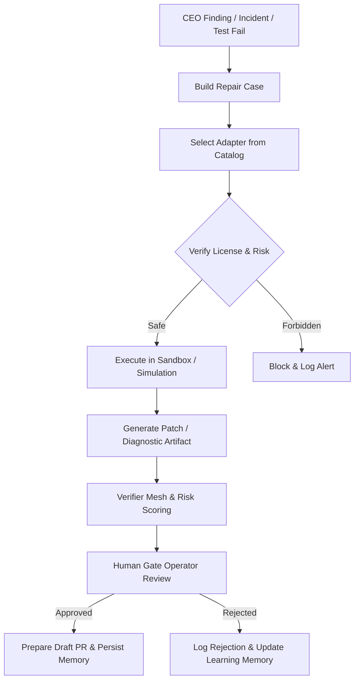

# Implementation Plan — Phase 32: External Repo Intake & Governance

This plan outlines the integration of external developer-agent repositories and utilities (`SWE-agent`, `SWE-ReX`, `PR-Agent/Qodo`, `Stagehand`, `OpenHands`, and architectural patterns from `GitHub Copilot`) into the Sovereign AGI self-repair and governance pipeline.

We adhere strictly to the **governance-first principle**: **CEO Finding → Repair Case → External Agent Adapter → Artifact → Verifier/Risk → Human Gate → Draft PR/Learning Memory**.

---

## Scope

### In-Scope
1. **Catalog Definition**: Creation of `configs/external_agent_catalog.yaml` to specify metadata (name, repo_url, pinned_commit, license, purpose, risk_level, allowed_modes, forbidden_actions).
2. **Adapter Layer**: Extending `services/repair/external_repo_integrations.py` to act as the single source of truth for loading, verifying, and routing external tools.
3. **Safety & Sandbox Guardrails**: Ensuring external agents are executed only in safe environments, outputs are compiled as clean artifacts, and risk assessments are applied.
4. **Human Gate Enforcement**: Requiring operator approval for any external patch candidates before they can be merged or pushed.
5. **Testing/Verification**: Comprehensive tests ensuring catalog parsing, safety controls, and mock/real adapter flows execute correctly.

### Out-of-Scope (This Phase)
- Automatic merging/pushing of unreviewed patches without operator verification.
- Direct vendor-in of external code without safe adaptation wrappers.
- Executing active agents with direct access to production secrets/DBs.
- Bypassing the Human Gate.

---

## Architectural Flow & Pipeline

---

## Action Plan

### Step 1: Catalog Creation (`configs/external_agent_catalog.yaml`)
Create the catalog with strict governance fields:
- Pinned commit / version
- License compliance check (e.g., Apache-2.0, MIT)
- Allowed modes (reference_only, local_adapter, sandbox_runner, review_gate, experimental)
- Forbidden actions (direct_git_push, production_secrets_read, etc.)

### Step 2: Extend Orchestrator/Integrations Adapter (`services/repair/external_repo_integrations.py`)
- Add a parser for `external_agent_catalog.yaml` using PyYAML.
- Add a validation function `validate_agent_execution(agent_name, requested_mode)` that checks if the request complies with the catalog's `allowed_modes` and `risk_level`.
- Implement safety checker to block any actions in `forbidden_actions`.

### Step 3: Update and Align Individual Adapters
Ensure each adapter has a unified API and maps to the catalog properties:
- `swe_rex_adapter.py`: Sandboxed command runner and execution coordinator.
- `stagehand_adapter.py`: UI diagnosis, Playwright trace collection, visual assertion runner.
- `pr_agent_adapter.py`: Patch review and risk rating.
- `mini_swe_adapter.py` / `swe_agent_adapter.py`: Issue-to-patch code generation.
- Add a mock/placeholder adapter logic for heavier tools like `OpenHands` and `GitHub Copilot` (reference_only / experimental).

### Step 4: Integration in Self-Repair Workflow
Connect the catalog validation and adapters to `services/repair/repair_orchestrator.py` during `generate_patch_candidate_step`.

### Step 5: Verification & Testing
- Write unit tests in `tests/repair/test_external_repo_governance.py` to assert:
  - Valid catalog loading and schema compliance.
  - Rejection of unauthorized/forbidden modes or actions.
  - Flow integrity from Case Builder to Risk Score to Human Gate.
- Run tests and fix any issues iteratively using standard python testing (`pytest`).

---

## Phase 3 — Repair Case → TaskFlow v2 Run Bridge

### Purpose
Bridges the generated `repair_outputs/{incident_id}/repair_case.json` artifact to a live `self_repair` TaskFlow run, persists run details, and updates the CEO finding status to `TASKFLOW_RUNNING` or `REPAIR_CASE_CREATED` depending on the `auto_start` configuration.

### Scope
- **In-Scope**:
  - Deserialize and validate `repair_case.json` securely.
  - Map `RepairCaseInput` and finding details to a valid registered `self_repair` workflow run (`Project` + `SubTask` records).
  - Enqueue the workflow job asynchronously using `job_queue.enqueue("run_project", ...)`.
  - Handle `auto_start=True` and `auto_start=False` logic correctly:
    - If `auto_start=True`: status updates to `TASKFLOW_RUNNING` or `TASKFLOW_QUEUED` (and job enqueued).
    - If `auto_start=False`: status updates to `REPAIR_CASE_CREATED` (and job not enqueued).
  - Persist metadata regarding the started run to `repair_outputs/{incident_id}/taskflow_run.json`.
  - Detailed integration tests in `tests/integration/test_ceo_repair_taskflow_bridge.py`.

- **Out-of-Scope**:
  - Real execution of external subprocesses (wrapped inside the adapters).
  - Automated pull request merging/pushing.

### Implementation Steps
1. **Update `services/orchestration/ceo/repair_bridge.py`**:
   - Make `start_self_repair_from_repair_case` an `async` function.
   - Inject dependencies/repositories required for workflow project creation and database sessions.
   - Map `RepairCaseInput` variables to the `Project` model context `execution_context` (standardizing all required keys like `incident_id`, `source="ceo_finding"`, etc.).
   - Dispatch to `job_queue` if `auto_start=True`.
   - Write output metadata file `taskflow_run.json` containing the started run's parameters under the incident folder.
2. **Update Endpoint `POST /api/v1/ceo/findings/{finding_id}/repair-case`**:
   - Ensure it calls the updated `async` bridge function.
   - Return structured response including the created workflow ID/job details.
3. **Integration Tests (`tests/integration/test_ceo_repair_taskflow_bridge.py`)**:
   - Implement comprehensive tests for `auto_start=True` (confirming project DB creation, enqueuing, and `taskflow_run.json` artifact) and `auto_start=False`.
   - Add resilience tests to guarantee graceful handling of enqueuing/dispatch failures without deleting the compiled case.

---

## Success Criteria & Definition of Done
1. `external_agent_catalog.yaml` is fully specified and validates under yaml loader.
2. `external_repo_integrations.py` is capable of loading and checking safety rules of all candidates.
3. Patch generation using an adapter is properly intercepted by the Risk Scoring & Verifier Mesh.
4. Test suite coverage is >80% for new integration code.
5. Zero modifications are made to the live repository without Human Gate approval.
6. A live TaskFlow workflow project is programmatically created, enqueued, and tracked correctly inside the database for every `auto_start=True` repair case request.

---

## Phase 5 — Human Gate Decision Center

### Purpose
Transition the `approval_gate` taskflow step from a passive wait state into a strict, evidence-driven human-in-the-loop gate. All high-risk runs require structured operator sign-off containing rationale, risk acknowledgment, target candidate ID, and a valid rollback plan reference.

### Scope
* **In-Scope**:
  * Solidify the `human_gate_decision.json` schema and enforce validation rules (non-empty rationale, candidate existence, high-risk acknowledgment, rollback plan validation, blocking policy-denied or sandbox-failed patches).
  * Persist every decision with non-repudiable audit logs written sequentially to `human_gate_audit.jsonl`.
  * Expose dedicated endpoints for querying and submitting decisions:
    * `GET /api/v1/repair-lab/runs/{run_id}/human-gate`
    * `POST /api/v1/repair-lab/runs/{run_id}/human-gate/decision`
  * Integrate the gate directly into `self_repair_v1` workflow step logic.
  * Implement rigorous unit/contract and API integration tests.

### Implementation Steps
1. **Model & Validation Core** (`services/repair/human_gate.py`):
   * Define enum-based types for decisions, operator actions, and status.
   * Add validator functions to enforce:
     * Non-empty operator rationale.
     * Candidate inclusion inside the candidate list.
     * Mandatory `risk_acknowledgement` if risk score > `risk_threshold`.
     * Mandatory `rollback_plan_ref` if `rollback_required` is true.
     * Safety blocks preventing approval of `policy denied` or `sandbox failed` candidates, or if missing critical verifier results.
   * Implement `record_human_gate_decision` to load existing schemas, validate the request, write the decision to `human_gate_decision.json`, and append JSON lines to `human_gate_audit.jsonl`.
2. **Workflow Engine Adaptation** (`services/taskflow/tasks/` or `self_repair_v1` step handlers):
   * Update `approval_gate` handler to halt execution if `risk_score > threshold` and no decision artifact exists.
   * Update `prepare_draft_pr` handler to block if `human_gate_decision.status` is not `APPROVED` or `DRAFT_PR_ONLY`.
3. **Router Endpoints** (`services/workflow_api/repair_lab_router.py`):
   * Add `GET /runs/{run_id}/human-gate` and `POST /runs/{run_id}/human-gate/decision`.
4. **Testing Suites**:
   * Create `tests/repair/test_human_gate_decision.py` for validation constraints and audit logging.
   * Create `tests/integration/test_repair_lab_human_gate_api.py` for endpoint contract validation.

